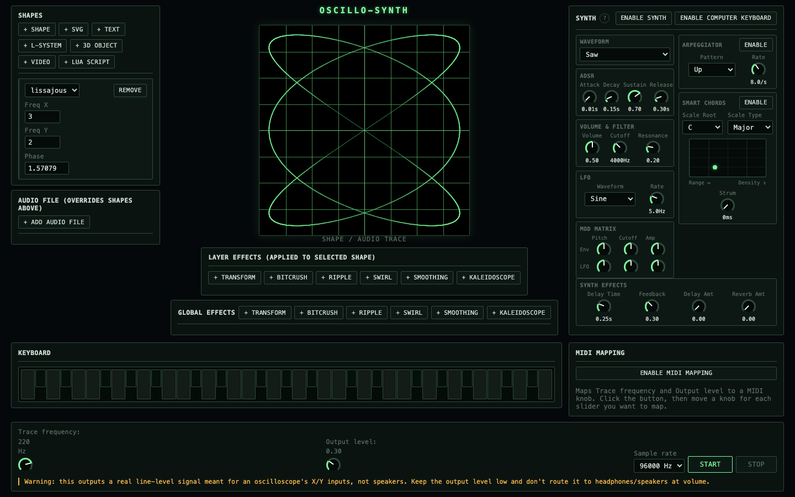

# oscillo-synth

A browser-based oscilloscope art and synth instrument. Draw shapes, SVGs, text, L-systems, 3D objects, video, or Lua scripts as an X/Y trace on a real oscilloscope (or the on-screen preview) — and play a full synth alongside it, built for making music with a scope as the visualizer.



## What it does

**Shape tracing**
- Parametric shapes (Lissajous, circle, square), SVG import, text (with font upload), L-systems, 3D meshes (OBJ/glTF), video frame tracing, and Lua scripts (with a handful of built-in presets)
- Per-layer and global effects: Transform, Bitcrush, Ripple, Swirl, Smoothing, Kaleidoscope
- An audio file can be routed straight through as the trace signal, overriding shapes
- Outputs a real line-level X/Y signal meant for an actual oscilloscope's inputs — keep the level low if you're monitoring through speakers/headphones instead

**Synth**
- Oscillator (sine/saw/square/triangle) → ADSR envelope → state-variable filter → LFO, with a mod matrix routing envelope/LFO to pitch, cutoff, and amp
- Arpeggiator, and a "Smart Chords" mode that turns a single note into a full chord from a scale/root, with an XY pad for chord range and density and a strum control
- Delay and reverb
- Play it with a MIDI keyboard or your computer keyboard; the on-screen keyboard shows what's playing
- While the synth is running, the main screen shows its live waveform (time-domain, trigger-locked) instead of the shape trace

MIDI CC learn is available for mapping trace frequency and output level to a hardware controller.

## Getting started

Requires [Node](https://nodejs.org/) 18+ and [pnpm](https://pnpm.io/).

```bash
pnpm install
pnpm dev
```

Open the printed local URL. Everything runs client-side — no server/backend involved.

Other useful commands:

```bash
pnpm build       # production build (apps/web)
pnpm typecheck   # typecheck every package
```

## Project structure

A pnpm workspace monorepo:

- `packages/engine` — pure TypeScript: shape sources, effects, the render pipeline, and the synth's DSP (oscillator, filter, envelope, LFO, arpeggiator, mod matrix, Smart Chords). No DOM/Web Audio dependencies, so it's usable from a worklet or any other host.
- `packages/platform-web` — the browser-specific layer: Web Audio graph setup, the render and synth `AudioWorklet`s, MIDI, and the canvas previews (X/Y trace and oscilloscope waveform).
- `packages/ui-web` — the app itself: a single-file UI (`app.ts`) built from plain HTML template strings and event delegation, no framework.
- `packages/shared-types` — types shared across packages.
- `apps/web` — the Vite entry point that ties it together.

## License

[MIT](LICENSE)
